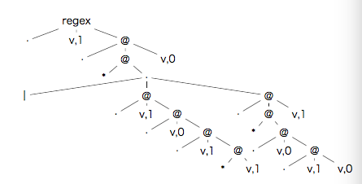
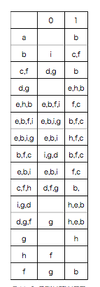

> ##Project 1. 构建词法分析器
> ####编译原理
> ######俞科杰 软工1503 201526810129


#1. Overview
###1.1 大致过程
```flow
op1=>start: 正规式(Regex)
op2=>start: 不确定自动机(NFA)
op3=>start: 确定有穷自动机(DFA)
op1(right)->op2(right)->op3
```
###1.2 使用工具
- 编程语言 : Python3
- 编辑器 : sublime Text 
- 画图工具 : graphviz (用于画状态图)

    ```    
    pip3 install graphviz   ### install first
    
    import graphviz as gv
    
    g = gv.Digraph()
    g.node(node_name, peripheries, color)
    g.edge(start,ternemal,label)
    g.render(filename)
    ```

#2. 具体过程
###2.1 Regex -> NFA
首先将正规式regex中的信息进行**存储**，即解析regex中的 `[ *,|,(,),0,1 ]`。此处采用 **树** 的形式进行存储。而在 python 中，可以采用 **列表 list** 的数据结构进行存储，因为可以采用 `append()` 和 `pop()` 方法对 **元组 tuple** 进行多层嵌套。

例如可将正则式 `regex = 1(1010*|1(010)*1)*0` 经过以下方法转化为一个嵌套的元组。

```
    def __init__(self, regex):
        self._reg = regex    ##正规式  1(1010*|1(010)*1)*0
        self._value = []
        self._value_set = set()  #无序不重复
        _op = []

        def judge_concat():
            # print("i:",i)
            # print("op",_op)
            if i + 1 < len(self._reg) and self._reg[i + 1] not in ['*', '|', ')']:
                _op.append('.')

        for i in range(0, len(self._reg)):
            ch = self._reg[i]
            if ch == '*':
                v = self._value.po)p()  
                self._value.append(('*', v)) #add in the end
                judge_concat()
            elif ch == '|':
                while len(_op) != 0 and _op[-1] == '.':
                    v1 = self._value.pop()
                    v2 = self._value.pop()
                    self._value.append((_op.pop(), v2, v1))
                _op.append('|')
            elif ch == '(':
                _op.append('(')
            elif ch == ')':
                op = _op.pop()
                while op != '(':
                    v1 = self._value.pop()
                    v2 = self._value.pop()
                    self._value.append((op, v2, v1))
                    op = _op.pop()
                judge_concat()
            else:
                self._value_set.add(ch)
                self._value.append(('v', ch))
                judge_concat()

        while len(_op) != 0:
            v1 = self._value.pop()
            v2 = self._value.pop()
            self._value.append((_op.pop(), v2, v1))
        self._value = self._value[0]
```

最终返回的 `self._value` 的值为

```
regex = 1(1010*|1(010)*1)*0
###以下为形象化的，实际中没有空格和缩进
('.', ('v', '1'), 
    ('.',
        ('*', 
            ('|', 
                ('.', ('v', '1'), 
                    ('.', ('v', '0'),
                        ('.', ('v', '1'), 
                            ('*', ('v', '0'))
                        )
                    )
                ),
                ('.', ('v', '1'), 
                    ('.', 
                        ('*', 
                            ('.', ('v', '0'),
                                ('.', ('v', '1'), 
                                    ('v', '0')
                                )
                            )
                        ),
                    ('v', '1'))
                )
            )
        ), 
    ('v', '0'))
)
```
由于有多层嵌套，而转化为 **树** 的形式即一下形状




其中
 
-  `.` 代表 后两个元素是**串联**的，即 **连接** 关系
-  `|` 代表 后两个元素是**并联**的，即 **或** 关系
- `*` 代表后一个元素是 **闭包的**,
- 而`v,1`或`v,0`则代表该节点的值
- 每个节点的深度与`()`有关，即代表一点的**优先顺序** ,即节点层数越深，计算**优秀及**越高。

至此已将正则式通过元组的数据结构进行**存储**了，而将其转化位 NFA图，只需要按照上述思路及规则进行**遍历**，具体代码实现如下

```
 def _generate_nfa(self, v, s, t=None):  
        if v[0] == 'v':
            if t is None and v[1] == RegexDFA.EPSILON:
                return s, s
            if t is None:
                t = self._new_node()
            self._new_edge(s, t, v[1])
            return s, t
        elif v[0] == '.':
            e1 = self._generate_nfa(v[1], s)
            e2 = self._generate_nfa(v[2], e1[1], t)
            return s, e2[1]
        elif v[0] == '|':
            if t is None:
                t = self._new_node()
            e1 = self._generate_nfa(v[1], s, t)
            e2 = self._generate_nfa(v[2], s, t)
            return s, t
        elif v[0] == '*':
            self._generate_nfa(v[1], s, s)
            if t is not None:
                self._new_edge(s, t, RegexDFA.EPSILON)  # epsilon == '&' 
            return s, s
            
def _new_edge(self, s, t, v)  # start ternamel label 
def _new_node(self) # node_count = tree_depth
```
通过使用 **递归函数** 遍历树，最终生成了 NFA 的 节点和边

```
[['1', '2', '1'], ['2', '3', '1'], ['3', '4', '0'], ['4', '5', '1'], ['5', '5', '0'], ['5', '2', '&'], ['2', '6', '1'], ['6', '7', '0'], ['7', '8', '1'], ['8', '6', '0'], ['6', '2', '1'], ['2', '9', '0']]
```
再通过使用工具`graphviz`画图展示即生成 NFA 图片

```
###生成的 graphviz 代码 
digraph {
	1 [color=blue]
	2
	3
	4
	5
	6
	7
	8
	9 [color=red peripheries=2]
	1 -> 2 [label=1]
	2 -> 3 [label=1]
	3 -> 4 [label=0]
	4 -> 5 [label=1]~~~~
	5 -> 5 [label=0]
	5 -> 2 [label="&"]
	2 -> 6 [label=1]
	6 -> 7 [label=0]
	7 -> 8 [label=1]
	8 -> 6 [label=0]
	6 -> 2 [label=1]
	2 -> 9 [label=0]
}

```


--

###2.2 NFA -> DFA
由于 NFA 的边已经可以进行表示，而转化为 DFA 只需要经过 **子集法** 的运算即得到 DFA。

进行子集法之前还需定义两个运算方法

- **闭包 e_closure（I** -> 表示状态集 I 中的任何状态 S 经任意条 ε 弧能达到的状态集
- **弧转换 move（I,a）** -> 表示从 I 中的某一状态经过 一条 a 弧能达到的状态集

而子集法的**大概思路** 即将NFA 中某一状态可通过`"&"`进行转移而到达的一些状态归为一个同一类，最后将新生成的状态集重新编号即表示成 DFA.

针对上述例子进行 NFA->DFA 转化的过程如下图所示。



而具体实现如下,其中子集法的体现在于 `while` 循环中:

```
def generate_dfa(self):
   self._has_dfa = False
   self._dfa_node = []
   self._dfa = []
   self._dfa_go = {}
   if not self._has_nfa:
       self.generate_nfa()
   e = []
   DT = []
   self._dfa_end = set()
   T = [self._e_closure('1')] 
   # print(T)
   while len(T) > 0: # 存在尚未被标记的子集 T
       t = T.pop()   # 去标记 t
       DT.append(t)  
       for k in self._value_set: # k即字母表
           U = set()
           for i in t:
               i = str(i)
               for d in self._move(i, k):
                   U = U.union(set(self._e_closure(d)))
               if str(self._end) in U:
                   U.add('T')
           if len(U) == 0:
               continue
           e.append((t, U, k))
           if U not in DT and U not in T:    #U 新产生即未被标记
               T.append(U)
   for s, t, k in e:
       s = str(DT.index(s) + 1)
       t = str(DT.index(t) + 1)
       self._dfa.append((s, t, k))
       self._dfa_go[(s, k)] = t
   DT[0].add('S')
   self._dfa_node = DT
   self._has_dfa = True
   
def _e_closure(self, i):
if i is None:
  return []
return {i}.union(self._edge_go.get((i, RegexDFA.EPSILON), []))

def _move(self, i, k):
return self._edge_go.get((i, k), [])
```

生成结果如下,可与**上面表格**进行对应，`U`即最左一列,表示需要被标记的集合，而 `e` 则是表格右边两列，即生成的集合。


```
U
[{'1'}, {'2'}, {'3', '6'}, {'7', '4'}, 
{'8', '5', '2'}, {'6', 'T', '9', '2', '5'}, {'3', '6', '2'}, {'7', 'T', '4', '9'}, {'7', '9', '2', 'T', '5'}, {'8', '6', '3'}, {'7', '6', '4'}, {'7'}, {'8'}, {'6'}, {'T', '5', '9', '2'}, {'T', '9'}]

e: s t k 
{'1'} {'2'} 1
{'2'} {'T', '9'} 0
{'2'} {'3', '6'} 1
{'3', '6'} {'7', '4'} 0
{'3', '6'} {'2'} 1
{'7', '4'} {'8', '5', '2'} 1
{'8', '5', '2'} {'6', 'T', '9', '2', '5'} 0
{'8', '5', '2'} {'3', '6'} 1
{'6', 'T', '9', '2', '5'} {'7', '9', '2', 'T', '5'} 0
{'6', 'T', '9', '2', '5'} {'3', '6', '2'} 1
{'3', '6', '2'} {'7', 'T', '4', '9'} 0
{'3', '6', '2'} {'3', '6', '2'} 1
{'7', 'T', '4', '9'} {'8', '5', '2'} 1
{'7', '9', '2', 'T', '5'} {'T', '5', '9', '2'} 0
{'7', '9', '2', 'T', '5'} {'8', '6', '3'} 1
{'8', '6', '3'} {'7', '6', '4'} 0
{'8', '6', '3'} {'2'} 1
{'7', '6', '4'} {'7'} 0
{'7', '6', '4'} {'8', '5', '2'} 1
{'7'} {'8'} 1
{'8'} {'6'} 0
{'6'} {'7'} 0
{'6'} {'2'} 1
{'T', '5', '9', '2'} {'T', '2', '9', '5'} 0
{'T', '5', '9', '2'} {'3', '6'} 1
[Finished in 1.4s]
```

由于此处需要有集合的合并，即`U = U.union(set(self._e_closure(d)))`，因此用到了**并查集**的数据结构，通过其的 `union` 方法将元素合并到一个集合里，这里采用 `UnionFind`的类来实现操作。[并查集 https://zh.wikipedia.org/wiki/%E5%B9%B6%E6%9F%A5%E9%9B%86](https://zh.wikipedia.org/wiki/%E5%B9%B6%E6%9F%A5%E9%9B%86)

代码来自[http://aspn.activestate.com/ASPN/Cookbook/Python/Recipe/215912](http://aspn.activestate.com/ASPN/Cookbook/Python/Recipe/215912)
>关于 UnionFind 介绍
>The union find data structure is primarily used for Kruskal's Minimum Spanning Tree algorithm, though can be used whenever one only needs to determine of two items are in the **same set**, and be able to **combine sets** quickly.

最终将获得的集合重命名成新的结点，以及对应的操作的跳转进行整理后用graphviz画图得出如下结果。


###2.3 DFA 最小化


#3. 词法分析器的使用
上述词法分析器 (DFA)可用于识别字符串是否符合`regex = 1(1010*|1(010)*1)*0`，即从头读入一个字符串，每读一个看是否有对应的跳转，若没有，泽说明不符合该词法。

#4.Reference
- [知乎轮子哥;《构造可配置词法分析器》;描述了从简单的正则表达式构造ε-NFA，随后转换到DFA的算法。提出了一种可配置词法分析器的实现(但还没怎么看懂)](http://www.cppblog.com/vczh/archive/2008/05/22/50763.html)
- [自己动手开发编译器（三）有穷自动机;描述正规式到 NFA ，再到 DFA 的转换](http://www.cnblogs.com/Ninputer/archive/2011/06/10/2077991.html)
- [自己动手开发编译器（四）利用DFA转换表建立扫描器；描述利用生成的 DFA 进行词法分析分的方法，即上述第三步中词法分析器的使用的具体实现](http://www.cnblogs.com/Ninputer/archive/2011/06/12/2078671.html)

- [Github@AmunFadaee](https://github.com/AminFadaee/Regex2DFA)
- [Github@xuhongxu96](https://github.com/xuhongxu96/regex2dfa)

