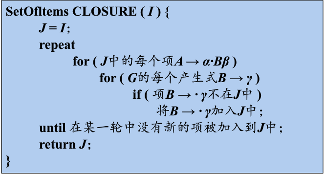
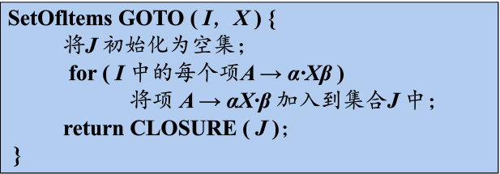
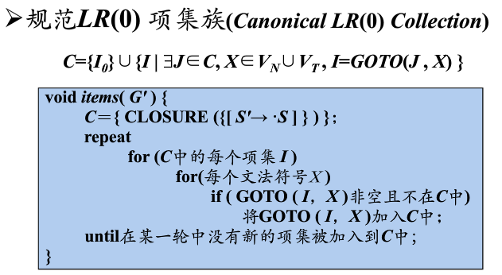
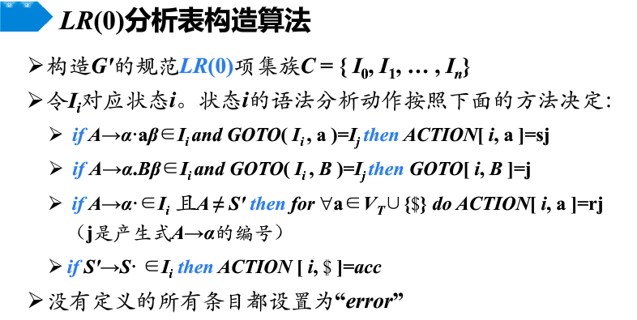

> ##Project 3. 自底向上语法分析 LR(0)
> ####编译原理
> ######俞科杰 软工1503 201526810129


#1. Overview
###1.1 自底向上分析
将 *输入串w* **规约** 为*文法S*。
采用**最左规约**方式，反向构造最右推导。
过程：**移入 - 规约**分析（Shift - Reduce Parsing）

**关键问题** => 过程中如何正确识别 **句柄**
###1.2 LR 分析
#####1.2.1 构造移入-规约语法分析器
- L => 对输入串从左到右扫描 
- R => 反向构造一个最右推导
- LR(K) 向前查看 k 个输入符号

通过**『状态』** 表示句柄识别进程 => 构造自动机

#####1.2.2 LR 分析器组成
- 状态/符号栈
- 输入缓冲区
- 分析表
    - 动作表 ACTION
    - 转移表 GOTO 


###1.3 LR（0）分析
如何构造 **LR分析表**
##### 1.3.1 项目
用于描述**句柄识别的状态**

```
- 移进项目 S -> ·bBB
- 待约项目 S -> b·BB  、 S -> bB·B
- 规约项目 S -> bBB·

- 后继项目(successive item)
    如 S -> bBB· 是 S -> bB·B 的后继项目
    
- 项目闭包集 I （closure of item set）
    等价的项目集，一个 I 对应自动机的一个状态  
```

##### 1.3.2 构造 LR(0) 自动机
1. 写出每个产生式的项目
2. 找出等价项目集闭包以及前后关系（等待、后继项目）
3. 构成自动机
 
##### 1.3.3 构造 LR(0) 分析表
- ACTION
    - 移入状态
    - 规约状态
- GOTO 状态转移

#2. 实现步骤
###2.1 构造自动机
文法 $ G = (Vn,Vt,P,S)$

```
'''
S' -> S
S  -> BB
B  -> aB
B  -> b
'''
G = {               # dict
	"S'": {'S'},     # set
	'S': {'BB'},
	'B': {'aB', 'b'}
}
```

$CLOSURE(I)$  项目集闭包



$GOTO(J,X)$   后继项目集闭包



构造状态集 $C = \{I_0,I_1...I_n\} $


```
C = {               # dict
	'I0': {            #dict 
		"S'": {'.S'},     #set
		'S': {'.BB'}, 
		'B': {'.b', '.aB'}
	}, 
	'I1': {
		'S': {'B.B'}, 
		'B': {'.b', '.aB'}
	}, 
	'I2': {
		"S'": {'S.'}
	}, 
	'I3': {
		'B': {'b.'}
	}, 
	'I4': {
		'B': {'.b', 'a.B', '.aB'}
	}, 
	'I5': {
		'S': {'BB.'}
	}, 
	'I6': {
		'B': {'aB.'}
	}
}
```

自动机 $M =(C,Vn \cup Vt,GOTO,I_0,F)$

```
----C_go----
{('I0', 'S', 'I3'), ('I4', 'B', 'I6'), ('I0', 'a', 'I4'), ('I4', 'b', 'I2'), ('I4', 'a', 'I4'), ('I1', 'a', 'I4'), ('I0', 'B', 'I1'), ('I1', 'B', 'I5'), ('I1', 'b', 'I2'), ('I0', 'b', 'I2')}
----C_end----
{'I3', 'I6', 'I2', 'I5'}

```
初始项目集 $I_0 = CLOSURE(\{S'->.S\})$ 
终止项目集 $F =\{CLOSURE(\{S'->S.\})\}$

###2.2 构造分析表
$ACTION[i,a] = sj$
$GOTO[i,B] = j$



#3. 其他
###3.1 冲突
- 归约\归约冲突
- 归约\移入冲突

没有冲突的文法 -> LR(0)文法

###3.2 其他LR 分析法
- SLR
- LR(1)


#Problem
- dictionary changed size during iteration

```
    - RuntimeError: dictionary changed size during iteration
    - solve:
    https://cito.github.io/blog/never-iterate-a-changing-dict/
```

- 比对 dict 对象  (与 set 区别)

```
def find_in_C(self,GT):   #!!!!查找当前项目集是否已经在 C 中
	for one in GT.keys():
		for i in self.C:
			if one in self.C[i].keys():
				for one_in_GT in GT[one]:
					if one_in_GT not in self.C[i][one]:
						return False
	return True


## Easy solve
G ={
	"S'": {'S'},
	'S': {'BB'},
	'B': {'aB','b'}
}
C = {
	"S'": {'S'},
	'S': {'BB'},
	'B': {'aB','b'},
	'B': {'aB','b','c'},
}
print (C == G)     #false
```

